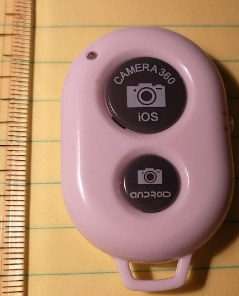

# AndroidButtonApp

Amazonで送料・電池込みで約100円で売っている、自撮りシャッターデバイスを使って、Android 端末でCANDY HOUSE の sesame smartlock のコントロールを行います。



# 必要なもの

* CANDY HOUSE sesame smartlock with WifiAP
* sesame API auth token (retrieved at CANDY HOUSE dashboard) and device ID
* 自撮りシャッターデバイス（ABShutter3) 
* Android handset API level26 (Ver 8.0 Oreo)

# 設定

アプリから sesame smartlock の WebAPI を呼び出します。APIキー、およびセサミIDを取得してください
[CANDY HOUSE blog](https://ameblo.jp/candyhouse-inc/entry-12416936959.html)  

app/src/main/assets/buttonapp.properties に埋め込みます

known button device descriptors の部分は最初は気にしなくていいです. 
デバイス一つしかない場合は一つだけ設定して、対応するソースコードを変更する必要があります.

```
cd app/src/main/assets
cp buttonapp.properties.sample buttonapp.properties
put your sesame API auth token (apikey) and sasame device ID(s) into buttonapp.properties
```

Build Variant: sesame_realmodeDebug でビルドしてください

# 注意

Android 端末で、アプリ毎に power management 設定を行う機能がある場合は、設定から外しておいてください。


